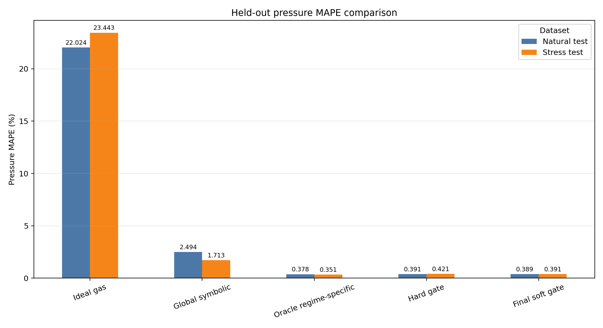
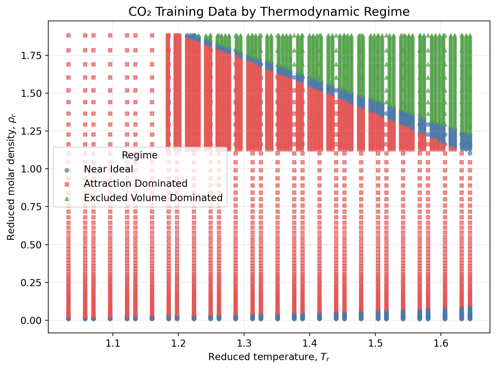
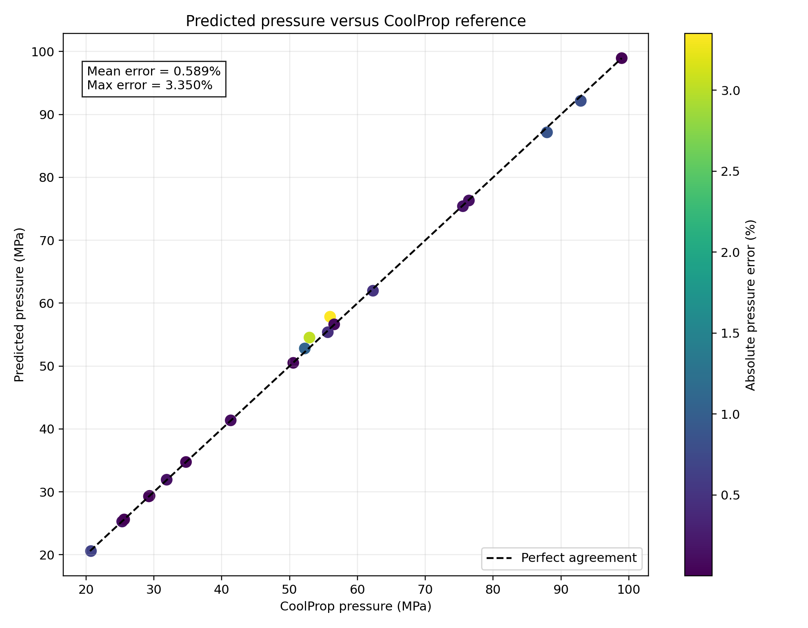

# Physics-Aware Symbolic Correction of the Ideal-Gas Law for CO₂

A physics-aware symbolic regression model for correcting the ideal-gas law of carbon dioxide across different thermodynamic regimes.

The model learns the compressibility-factor correction:

$$
Z = \frac{p}{\rho R T}
$$

and

$$
\Delta Z = Z - 1
$$

The final pressure prediction is:

$$
\hat{p} = \rho R T \left(1+\widehat{\Delta Z}\right)
$$

## Project Overview

The ideal-gas law becomes inaccurate when intermolecular attraction and excluded-volume effects become important.

This project combines:

- CoolProp-generated CO₂ reference data
- Physics-based regime definitions
- PySR symbolic regression
- Regime-specific symbolic models
- A learned thermodynamic regime gate
- Soft-gated final pressure inference

The goal is to obtain an interpretable correction model that is more accurate than a single global symbolic equation.

## Thermodynamic Regimes

The regimes are defined using:

$$
|\Delta Z| \leq 0.03
$$

- `near_ideal`
- `attraction_dominated`
- `excluded_volume_dominated`

The models use reduced temperature and reduced molar density as input features:

- $T_r = T/T_c$
- $\rho_r = \rho/\rho_c$

## Modeling Pipeline

1. Generate CO₂ thermodynamic data with CoolProp.
2. Calculate $Z$ and $\Delta Z$.
3. Define thermodynamic regimes.
4. Split the data by complete temperature isotherms.
5. Train a global symbolic regression model.
6. Train regime-specific symbolic models.
7. Train a regime gate using reduced thermodynamic features.
8. Combine the regime models with a soft gate.
9. Evaluate the final model on natural and high-density stress test sets.
10. Run standalone inference from temperature and molar density.

## Final Test Results

Pressure MAPE on the held-out test sets:

| Model | Natural test | Stress test |
|---|---:|---:|
| Global symbolic | 2.494% | 1.713% |
| Oracle regime-specific | 0.378% | 0.351% |
| Hard gate | 0.391% | 0.421% |
| Final soft-gate model | 0.389% | 0.391% |

The `oracle_regime_specific` model receives the true regime and therefore represents an upper bound.

The deployable model is `final_soft_gate_model`. It predicts regime probabilities using only reduced temperature and reduced molar density, then combines the regime-specific symbolic models using soft weighting.

## Inference Sanity Check

A 20-point stress sanity check produced:

- Mean pressure error: 0.589%
- Maximum pressure error: 3.350%

The standalone inference notebook accepts:

- Temperature in K
- Molar density in mol/m³

and returns:

- Predicted regime
- Gate probabilities
- Predicted compressibility factor
- Predicted pressure in Pa and MPa
- Comparison with CoolProp

## Figures

### Pressure MAPE Comparison



### Thermodynamic Regime Distribution



### Predicted Pressure versus CoolProp



## Repository Structure

```text
data/
  processed/                  # Generated datasets, ignored by Git

notebooks/
  01_CO2_Data_Generation.ipynb
  02_Global_Symbolic_Regression.ipynb
  03_Regime_Specific_Regression.ipynb
  04_Regime_Gate.ipynb
  05_Final_Inference.ipynb

results/
  figures/                    # Research figures
  tables/                     # Evaluation tables
  models/                     # Generated model files, ignored by Git

src/
  train_pysr.py

requirements.txt
README.md
```

## Reproducibility

Install the required Python packages:

```bash
pip install -r requirements.txt
```

Run the notebooks in this order:

1. `01_CO2_Data_Generation.ipynb`
2. `02_Global_Symbolic_Regression.ipynb`
3. `03_Regime_Specific_Regression.ipynb`
4. `04_Regime_Gate.ipynb`
5. `05_Final_Inference.ipynb`

The data split holds out complete temperature isotherms. The stress split is a separate high-density grid designed to test extrapolation and difficult non-ideal conditions.

PySR may install a compatible Julia version automatically when executed in Google Colab.

## Important Outputs

Tracked evaluation tables are stored in:

```text
results/tables/
```

Important files include:

- `final_test_comparison.csv`
- `final_regime_equations.csv`
- `gate_correctness_summary.csv`
- `gate_depth_summary.csv`
- `gate_results.csv`
- `soft_gate_comparison.csv`
- `inference_example_predictions.csv`
- `inference_sanity_check_20_points.csv`

Generated datasets and serialized model files are excluded from version control because they can be reproduced by running the notebooks.
